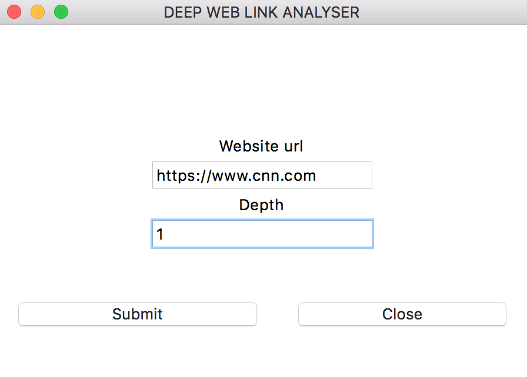
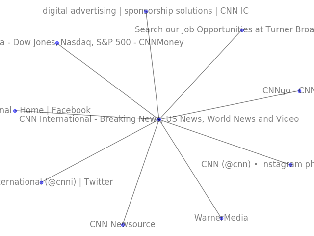

# WebAnalysis

Deep Web Analysis/Ranking

**Project uses python 3.7**






### Statement
Mini project to create a command line/GUI tool to scrape, analyse and plot the relationship between the link and any other link that might be visible from that address that are not internal links up to and including the depth specified. 

Eg: Given the url http://www.cnn.com and a depth n, it should find all links that are not in the given domain and visit those links postorder up to a depth equal to n.


### Input
Any valid web URL and a search depth


### Output
A graph plot showing the relationship between the pages scraped with the title of each page as the node and the an egde joining each page showing which pages have direct links to the other.


### Issue using matplotlib with MacOSX
https://stackoverflow.com/questions/21784641/installation-issue-with-matplotlib-python?answertab=active#tab-top


### Usage
Create a virtualenv and activate:
- http://sourabhbajaj.com/mac-setup/Python/virtualenv.html
- https://github.com/pyenv/pyenv-virtualenv

Run

```
python gui.py
```
